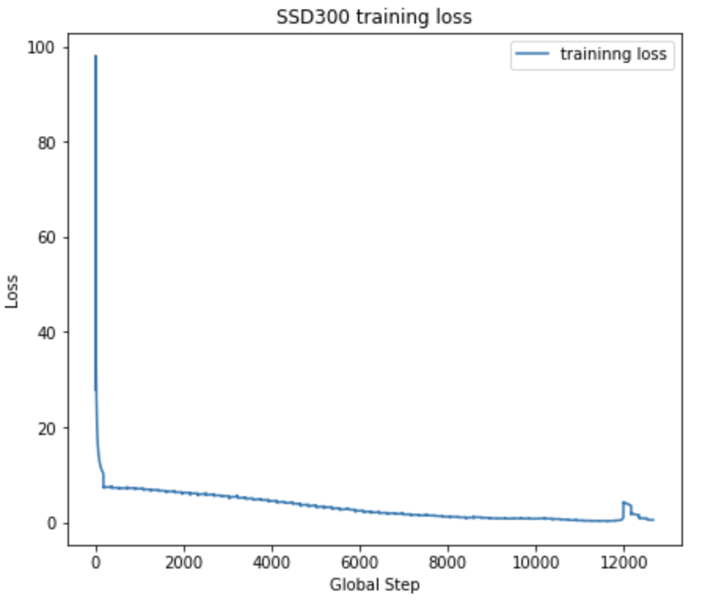

# SSD300 Model in PyTorch

## Team 
Shiming Luo, Jonathan Lam, Nathan Apolonio, Eric Megrabov

## Dataset
PASCAL VOC2012

## Usage

### Train the Model

Set the `download=True` for `train_dataset` and `val_dataset` for the first time training.

```bash
cd code
python3 train_ssd.py
```

Since the pre-trained VGG_16 weight is not uploaded (too big), this may call some error. But you could download it by following bash command.

```bash
cd weight
wget https://s3.amazonaws.com/amdegroot-models/vgg16_reducedfc.pth
``` 
This would make the program run properly.

### Evaluate the Model

```bash
cd code
python3 evaluation_ssd.py
```

tip: we need to train the model at least 1 epoch to save a trained weights and then evaluate the trained model.

### Get a Demo

```bash
cd code
python3 demo.py
```
The result images and ground truth images would be saved in directory called `img`

tips: Since the trained weigt is not been uploaded (too big), this part would call some errors. You could look into the directory `img` directly to see the result demo produced by ourselves.

### Result

#### Training Loss:



At around 12000 global step, the training loss increased rapidlly, so we change the learning rate from 1e-3 to 1e-4. 

#### On training set: 

mAP Matrix:

[0.91019469 0.84114809 0.88723437 0.67804573 0.37342244 0.91621779
 0.73382705 0.97321562 0.80776674 0.84021185 0.9088941  0.96271324
 0.92898749 0.95671725 0.66330431 0.69221699 0.78723723 0.95487637
 0.95664115 0.89042396]

mAP =  0.8331648228692401

#### On validation set:

mAP Matrix:

[0.72079278 0.54627386 0.47994215 0.38346232 0.11459754 0.70997109
 0.49702614 0.56876101 0.30975806 0.49377826 0.45675858 0.55071475
 0.60932779 0.60878767 0.41897762 0.21055238 0.47257278 0.39755191
 0.5924096  0.50312271]

mAP =  0.4822569492169384

The mAP on validation set may not as high as it on training set. It may because we did not do data augmentation.

## To Do
1. Data Augmentation


